```python
#imports
import pandas as pd
import numpy as np
import matplotlib.pyplot as plt
import seaborn as sns
from sklearn.linear_model import LogisticRegression
from sklearn.preprocessing import StandardScaler
from sklearn.decomposition import PCA
from sklearn.neighbors import KNeighborsClassifier
from sklearn.model_selection import train_test_split
from sklearn.tree import DecisionTreeClassifier
from sklearn.metrics import confusion_matrix
import time
from sklearn.model_selection import GridSearchCV
```

After importing our packages, we read in the .csv files for the test and train data sets


```python
train = pd.read_csv('clean_data/clean_train_dataframe.csv')
test = pd.read_csv('clean_data/clean_test_dataframe.csv')
```

We take a quick look at the shape and content of the train set, just to get an idea of what we're looking at.


```python
train.head(5)
```


<div>
<style scoped>
    .dataframe tbody tr th:only-of-type {
        vertical-align: middle;
    }

    .dataframe tbody tr th {
        vertical-align: top;
    }

    .dataframe thead th {
        text-align: right;
    }
</style>
<table border="1" class="dataframe">
  <thead>
    <tr style="text-align: right;">
      <th></th>
      <th>Additional_Number_of_Scoring</th>
      <th>Average_Score</th>
      <th>Review_Total_Negative_Word_Counts</th>
      <th>Total_Number_of_Reviews</th>
      <th>Review_Total_Positive_Word_Counts</th>
      <th>Total_Number_of_Reviews_Reviewer_Has_Given</th>
      <th>days_since_review</th>
      <th>lat</th>
      <th>lng</th>
      <th>weekday_of_review</th>
      <th>...</th>
      <th>n_worry</th>
      <th>n_worth</th>
      <th>n_would</th>
      <th>n_write</th>
      <th>n_wrong</th>
      <th>n_year</th>
      <th>n_yes</th>
      <th>n_yet</th>
      <th>n_young</th>
      <th>rating</th>
    </tr>
  </thead>
  <tbody>
    <tr>
      <th>0</th>
      <td>620</td>
      <td>9.0</td>
      <td>0</td>
      <td>1974</td>
      <td>164</td>
      <td>1</td>
      <td>562</td>
      <td>51.506558</td>
      <td>-0.004514</td>
      <td>1</td>
      <td>...</td>
      <td>0</td>
      <td>0</td>
      <td>0</td>
      <td>0</td>
      <td>0</td>
      <td>0</td>
      <td>0</td>
      <td>0</td>
      <td>0</td>
      <td>1</td>
    </tr>
    <tr>
      <th>1</th>
      <td>1258</td>
      <td>9.4</td>
      <td>6</td>
      <td>4204</td>
      <td>4</td>
      <td>5</td>
      <td>276</td>
      <td>51.502435</td>
      <td>-0.000250</td>
      <td>0</td>
      <td>...</td>
      <td>0</td>
      <td>0</td>
      <td>0</td>
      <td>0</td>
      <td>0</td>
      <td>0</td>
      <td>0</td>
      <td>0</td>
      <td>0</td>
      <td>1</td>
    </tr>
    <tr>
      <th>2</th>
      <td>995</td>
      <td>8.1</td>
      <td>2</td>
      <td>3826</td>
      <td>38</td>
      <td>1</td>
      <td>129</td>
      <td>51.504348</td>
      <td>-0.033444</td>
      <td>0</td>
      <td>...</td>
      <td>0</td>
      <td>0</td>
      <td>0</td>
      <td>0</td>
      <td>0</td>
      <td>0</td>
      <td>0</td>
      <td>0</td>
      <td>0</td>
      <td>1</td>
    </tr>
    <tr>
      <th>3</th>
      <td>853</td>
      <td>8.4</td>
      <td>7</td>
      <td>2726</td>
      <td>10</td>
      <td>10</td>
      <td>164</td>
      <td>51.507377</td>
      <td>0.038657</td>
      <td>0</td>
      <td>...</td>
      <td>0</td>
      <td>0</td>
      <td>0</td>
      <td>0</td>
      <td>0</td>
      <td>0</td>
      <td>0</td>
      <td>0</td>
      <td>0</td>
      <td>0</td>
    </tr>
    <tr>
      <th>4</th>
      <td>1243</td>
      <td>8.1</td>
      <td>11</td>
      <td>6608</td>
      <td>8</td>
      <td>69</td>
      <td>639</td>
      <td>51.513556</td>
      <td>-0.180002</td>
      <td>1</td>
      <td>...</td>
      <td>0</td>
      <td>0</td>
      <td>0</td>
      <td>0</td>
      <td>0</td>
      <td>0</td>
      <td>0</td>
      <td>0</td>
      <td>0</td>
      <td>0</td>
    </tr>
  </tbody>
</table>
<p>5 rows × 2744 columns</p>
</div>


```python
train.columns[0:420]
#A quick search reveals the word variables start at 417.
```


    Index(['Additional_Number_of_Scoring', 'Average_Score',
           'Review_Total_Negative_Word_Counts', 'Total_Number_of_Reviews',
           'Review_Total_Positive_Word_Counts',
           'Total_Number_of_Reviews_Reviewer_Has_Given', 'days_since_review',
           'lat', 'lng', 'weekday_of_review',
           ...
           'Hotel_Name_W12 Rooms', 'Hotel_Name_Washington Mayfair Hotel',
           'Hotel_Name_Windermere Hotel', 'Hotel_Name_citizenM London Bankside',
           'Hotel_Name_citizenM London Shoreditch',
           'Hotel_Name_citizenM Tower of London',
           'Hotel_Name_every hotel Piccadilly', 'p_', 'p_02', 'p_1'],
          dtype='object', length=420)


```python
train.shape
```


    (12798, 2744)


We will drop all non-word related columns, and set our dependent variable as 'rating'.


```python
#Use column list to drop out the non-word columns, then separately drop out the 'rating' column from our X matrix.
X_train = train.drop(train.columns[0:417], axis=1)
X_train = X_train.drop('rating', axis=1)
y_train = train['rating']
X_test = test.drop(test.columns[0:417], axis=1)
X_test = X_test.drop('rating', axis=1)
y_test = test['rating']
```

## Question 1

### Part A

Instantiate 


```python
#instantiate logistic regression with lbfgs solver
logfit = LogisticRegression(solver='lbfgs',max_iter=1000)
```


```python
#fit and score model
logfit.fit(X_train,y_train)
print(logfit.score(X_train,y_train))
print(logfit.score(X_test,y_test))
```

    0.8465385216440069
    0.7686899460979612


Our training and testing accuracy are a little off.  We will perform a simple search to try and optimize an L2 'Ridge' regression penalty.  Why L2?  Because we have a high number of variables that we think might influence the decision.  An L1 penalty would force many of these to zero.  These words would then have 0 influence in determining the score.  Instead, we just want to minimize them to prevent overfitting.


```python
#set list of penalties to examine, and initiate the test and train accuracy logs
penalties = [0.00001, 0.0001, 0.001, 0.01, 0.1, 0.5, 1]
test_accuracy = []
train_accuracy = []
for penalty in penalties:
    #instantiate, fit, and score
    logfit = LogisticRegression(solver='lbfgs',max_iter=1000,penalty='l2',C=penalty)
    logfit.fit(X_train_norm,y_train)
    train_accuracy.append(logfit.score(X_train_norm,y_train))
    #also score test data
    test_accuracy.append(logfit.score(X_test_norm,y_test))
#use seaborn scatter plot to plot data in log form
sns.scatterplot(x=penalties,y=train_accuracy)
sns.scatterplot(x=penalties,y=test_accuracy)
plt.xscale('log')
plt.legend(['Train Accuracy','Test Accuracy'])
plt.title('Train and Test Accuracy for L2 Penalties on NLP Data')
```


    Text(0.5, 1.0, 'Train and Test Accuracy for L2 Penalties on NLP Data')


    
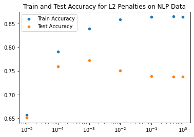
    


Let's zoom in on the best range.


```python
penalties = [0.0001, 0.00025, 0.0005, 0.00075, 0.001]
test_accuracy = []
train_accuracy = []
for penalty in penalties:
    logfit = LogisticRegression(solver='lbfgs',max_iter=1000,penalty='l2',C=penalty)
    logfit.fit(X_train_norm,y_train)
    train_accuracy.append(logfit.score(X_train_norm,y_train))
    test_accuracy.append(logfit.score(X_test_norm,y_test))
sns.scatterplot(x=penalties,y=train_accuracy)
sns.scatterplot(x=penalties,y=test_accuracy)
plt.xscale('log')
plt.legend(['Train Accuracy','Test Accuracy'])
plt.title('Train and Test Accuracy for L2 Penalties on NLP Data')
```


    Text(0.5, 1.0, 'Train and Test Accuracy for L2 Penalties on NLP Data')


    
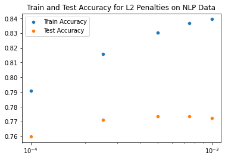
    


```python
test_accuracy
```


    [0.7597843918443872,
     0.7712678696976799,
     0.7736114366065151,
     0.7733770799156315,
     0.7724396531520975]


It looks like our best test accuracy is with an L2 penalty of 5x10-4. Let's rerun the model with an L2 of 5x10-4 so that we're ready to start extracting the most predictive words.


```python
logfit = LogisticRegression(solver='lbfgs',max_iter=1000,penalty='l2',C=.0005)
logfit.fit(X_train_norm,y_train)
train_accuracy.append(logfit.score(X_train_norm,y_train))
test_accuracy.append(logfit.score(X_test_norm,y_test))
```

### Part B

Sort coefficients and find the twenty most positive and twenty most negative words


```python
#We will create a dataframe and populate it with the train columns and train coefficients.
coefficients = pd.DataFrame(data=[],columns=['Column','Coefficient'])
```


```python
coefficients['Column'] = X_train.columns
coefficients['Coefficient'] = logfit.coef_[0]
```


```python
coefficients.set_index('Column',inplace=True)
```

We can now simply sort the datafame by coefficient strength.  We'll start with the 20 most positive words.


```python
#filter the dataframe to only contain positive words
pos_words = coefficients[coefficients.index.str.contains('p_')]
```


```python
#Look for postive words with high positive coefficients
pos_words.sort_values(by='Coefficient',ascending=False)[0:19]
```


<div>
<style scoped>
    .dataframe tbody tr th:only-of-type {
        vertical-align: middle;
    }

    .dataframe tbody tr th {
        vertical-align: top;
    }

    .dataframe thead th {
        text-align: right;
    }
</style>
<table border="1" class="dataframe">
  <thead>
    <tr style="text-align: right;">
      <th></th>
      <th>Coefficient</th>
    </tr>
    <tr>
      <th>Column</th>
      <th></th>
    </tr>
  </thead>
  <tbody>
    <tr>
      <th>p_staff</th>
      <td>0.119286</td>
    </tr>
    <tr>
      <th>p_excellent</th>
      <td>0.118883</td>
    </tr>
    <tr>
      <th>p_everything</th>
      <td>0.102030</td>
    </tr>
    <tr>
      <th>p_great</th>
      <td>0.087924</td>
    </tr>
    <tr>
      <th>p_lovely</th>
      <td>0.080355</td>
    </tr>
    <tr>
      <th>p_</th>
      <td>0.078932</td>
    </tr>
    <tr>
      <th>p_fantastic</th>
      <td>0.075409</td>
    </tr>
    <tr>
      <th>p_amaze</th>
      <td>0.072633</td>
    </tr>
    <tr>
      <th>p_perfect</th>
      <td>0.066343</td>
    </tr>
    <tr>
      <th>p_hotel</th>
      <td>0.064635</td>
    </tr>
    <tr>
      <th>p_room</th>
      <td>0.061928</td>
    </tr>
    <tr>
      <th>p_beautiful</th>
      <td>0.059463</td>
    </tr>
    <tr>
      <th>p_helpful</th>
      <td>0.059151</td>
    </tr>
    <tr>
      <th>p_love</th>
      <td>0.057840</td>
    </tr>
    <tr>
      <th>p_friendly</th>
      <td>0.056385</td>
    </tr>
    <tr>
      <th>p_superb</th>
      <td>0.048699</td>
    </tr>
    <tr>
      <th>p_service</th>
      <td>0.048652</td>
    </tr>
    <tr>
      <th>p_wonderful</th>
      <td>0.047951</td>
    </tr>
    <tr>
      <th>p_comfy</th>
      <td>0.046274</td>
    </tr>
  </tbody>
</table>
</div>


Interesting results.  Some of these would be expected, like 'excellent'.  Others are more neutral but are still hallmarks of postivity, such as 'everything' and 'staff'.  Let's try with negative words.


```python
#filter the dataframe to only contain negative words
neg_words = coefficients[coefficients.index.str.contains('n_')]
```


```python
#Look for negative words with highest NEGATIVE coefficients.  We are trying to set the rating to 0, or a bad review
#so negative coefficients are appropriate here.
neg_words.sort_values(by='Coefficient',ascending=True)[0:19]
```


<div>
<style scoped>
    .dataframe tbody tr th:only-of-type {
        vertical-align: middle;
    }

    .dataframe tbody tr th {
        vertical-align: top;
    }

    .dataframe thead th {
        text-align: right;
    }
</style>
<table border="1" class="dataframe">
  <thead>
    <tr style="text-align: right;">
      <th></th>
      <th>Coefficient</th>
    </tr>
    <tr>
      <th>Column</th>
      <th></th>
    </tr>
  </thead>
  <tbody>
    <tr>
      <th>n_room</th>
      <td>-0.120400</td>
    </tr>
    <tr>
      <th>n_small</th>
      <td>-0.101744</td>
    </tr>
    <tr>
      <th>n_</th>
      <td>-0.095950</td>
    </tr>
    <tr>
      <th>n_staff</th>
      <td>-0.095363</td>
    </tr>
    <tr>
      <th>n_poor</th>
      <td>-0.074305</td>
    </tr>
    <tr>
      <th>n_tire</th>
      <td>-0.069708</td>
    </tr>
    <tr>
      <th>n_uncomfortable</th>
      <td>-0.064769</td>
    </tr>
    <tr>
      <th>n_noisy</th>
      <td>-0.064078</td>
    </tr>
    <tr>
      <th>n_bed</th>
      <td>-0.061158</td>
    </tr>
    <tr>
      <th>n_basic</th>
      <td>-0.057928</td>
    </tr>
    <tr>
      <th>n_decor</th>
      <td>-0.055344</td>
    </tr>
    <tr>
      <th>n_tiny</th>
      <td>-0.053175</td>
    </tr>
    <tr>
      <th>n_work</th>
      <td>-0.052588</td>
    </tr>
    <tr>
      <th>n_date</th>
      <td>-0.052146</td>
    </tr>
    <tr>
      <th>n_bathroom</th>
      <td>-0.052118</td>
    </tr>
    <tr>
      <th>n_rude</th>
      <td>-0.049949</td>
    </tr>
    <tr>
      <th>n_noise</th>
      <td>-0.049593</td>
    </tr>
    <tr>
      <th>n_sleep</th>
      <td>-0.046268</td>
    </tr>
    <tr>
      <th>n_dark</th>
      <td>-0.044553</td>
    </tr>
  </tbody>
</table>
</div>


Interesting results again, and very similar to positive, where some of the words make sense, but others do not.  for example, 'poor' would make sense, whereas 'date' is less intuitive.

### Part C

We will now do PCA to reduce the dimensionality of this dataset.  Before performing PCA, we should remember to scale the data.  When transforming, we should not forget to fit only to the trained data set, then do the same transform to the test set. 


```python
#Instantiate Scaler
scaler = StandardScaler()
#fit to train set ONLY
scaler.fit(X_train)
#transform both test and train with the train fit
X_train_norm = scaler.transform(X_train)
X_test_norm = scaler.transform(X_test)
```


```python
X_train_norm.shape
```


    (12798, 2326)


```python
#add timeit to this loop
n_components = [1,5,10,50,100,500,1000,2326]
time_taken = []
test_accuracy = []
train_accuracy = []

for n in n_components:
    #Instantiate PCA
    PCA_NLP = PCA(n_components=n)
    # Fit to PCA
    PCA_NLP.fit(X_train_norm)
    # Transform the original data
    X_train_PCA = PCA_NLP.transform(X_train_norm)
    X_test_PCA = PCA_NLP.transform(X_test_norm)
    #record start time
    start_time = time.time()
    logfit.fit(X_train_PCA,y_train)
    train_accuracy.append(logfit.score(X_train_PCA,y_train))
    test_accuracy.append(logfit.score(X_test_PCA,y_test))
    #record end time and append
    time_taken.append(time.time() - start_time)
#make plotting easier by taking log of components.  Could also use plt.xscale to do this, but this way we only write it once.
log_n = np.log10(n_components)
#Plot Test and Train Accuracy
sns.lineplot(x=log_n,y=train_accuracy)
sns.lineplot(x=log_n,y=test_accuracy)
plt.legend(['Train Accuracy','Test Accuracy'])
plt.title('Log of N Component PCA vs Train and Test Accuracy')
plt.show()
#plot time taken.
sns.lineplot(x=n_components,y=time_taken)
plt.legend(['Time Taken'])
plt.title('Log of N Component PCA vs Time to Fit Logistic Regression')
plt.show()
```


    
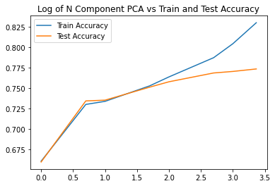
    


    
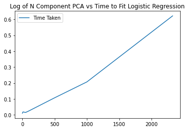
    


There is a linear relationship between time taken to fit and score the logistic regression and the number of components.  This is a very intuitive result, as logistic regression is based on linear combinations of variables.

### Part D

One advantage of PCA is that we can capture almost all of our variance in a smaller number of variables, leading to much faster computational speed on our linear regression model.  However, we also lose easy interpretability of the feature set.  

## Question 2

### Part A

We will first instantiate a quick KNN model using the standard n_neighbors of 3 to get a sense of the test and train accuracy of our KNN model.  We have already applied a standard scalar to our data during the previous PCA step, so we can leverage those variables from before.


```python
#instantiate model
KNN_model = KNeighborsClassifier(n_neighbors=3)
#fit model
KNN_model.fit(X_train_norm, y_train)
#get train and test accuracy.
print(f'Train Accuracy: {KNN_model.score(X_train_norm,y_train)}')
print(f'Test Accuracy: {KNN_model.score(X_test_norm,y_test)}')
```

    Train Accuracy: 0.8169245194561651
    Test Accuracy: 0.667682212327162


Our test accuracy is significantly lower than logistic regression.

### Part B

We can speed up the KNN model by taking a slice of the obversations.  Let's do that here by simply rerunning the test-train split and using only the kept portion of the data.


```python
#Set our sampling from 99% to 1%.
sample_rate = [0.99,0.5,0.1,0.05,0.01]
test_accuracy = []
train_accuracy = []
time_taken = []
for rate in sample_rate:
    #sample our data randomly, making sure to use the normalized data as our source
    X_kept, X_tossed, y_kept, y_tossed = train_test_split(X_train_norm, y_train, test_size=1-rate)
    #instantiate model and record start time
    KNN_model = KNeighborsClassifier(n_neighbors=3)
    start_time = time.time()
    #fit model 
    KNN_model.fit(X_kept,y_kept)
    #get scores
    train_accuracy.append(KNN_model.score(X_kept,y_kept))
    test_accuracy.append(KNN_model.score(X_test,y_test))
    #record end time and append
    time_taken.append(time.time() - start_time)
#make plotting easier by taking log of components.  Could also use plt.xscale to do this, but this way we only write it once.
#Plot Test and Train Accuracy
sns.lineplot(x=sample_rate,y=train_accuracy)
sns.lineplot(x=sample_rate,y=test_accuracy)
plt.legend(['Train Accuracy','Test Accuracy'])
plt.title('Sample Rate of KNN vs Train and Test Accuracy')
plt.show()
#plot time taken.
sns.lineplot(x=sample_rate,y=time_taken)
plt.legend(['Time Taken'])
plt.title('Sample Rate of KNN vs Time to Fit KNN')
plt.show()
```

    /Users/steve/opt/anaconda3/lib/python3.9/site-packages/sklearn/base.py:443: UserWarning: X has feature names, but KNeighborsClassifier was fitted without feature names
      warnings.warn(
    /Users/steve/opt/anaconda3/lib/python3.9/site-packages/sklearn/base.py:443: UserWarning: X has feature names, but KNeighborsClassifier was fitted without feature names
      warnings.warn(
    /Users/steve/opt/anaconda3/lib/python3.9/site-packages/sklearn/base.py:443: UserWarning: X has feature names, but KNeighborsClassifier was fitted without feature names
      warnings.warn(
    /Users/steve/opt/anaconda3/lib/python3.9/site-packages/sklearn/base.py:443: UserWarning: X has feature names, but KNeighborsClassifier was fitted without feature names
      warnings.warn(
    /Users/steve/opt/anaconda3/lib/python3.9/site-packages/sklearn/base.py:443: UserWarning: X has feature names, but KNeighborsClassifier was fitted without feature names
      warnings.warn(


    
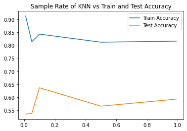
    


    
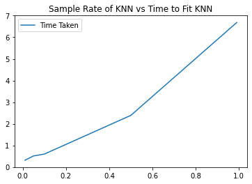
    


Time taken again appears roughly linear with the amount of sampling done.  Also, we do not lose much test accuracy even when we substantially reduce our sampling.

### Part C

One advantage of sampling a small amount of our dataset is that it does signficantly speed up processing time.  However, depending on the distribution of our data, we might miss important information by sampling.  In this case, the test loss was minimal but this is not guaranteed.

### Part D

For this part, we cannot use our previously scaled data, we need to rescale.  This is because what we will be using as the validation set this time was used to scale last time.


```python
#Set our possible N-neighbors and reset train and val accuracy logs
KNN = [1,2,3,5,10,20,30,50]
val_accuracy = []
train_accuracy = []
time_taken = []
#create validation set
X_train_KNN, X_val_KNN, y_train_KNN, y_val_KNN = train_test_split(X_train, y_train, test_size=.2)
#scale train and val sets
#Instantiate Scaler
scaler = StandardScaler()
#fit to train set ONLY
scaler.fit(X_train_KNN)
#transform both test and train with the train fit
X_train_KNN_norm = scaler.transform(X_train_KNN)
X_val_KNN_norm = scaler.transform(X_val_KNN)
X_test_KNN_norm = scaler.transform(X_test)
for neighbors in KNN:
    #instantiate model and record start time
    KNN_model = KNeighborsClassifier(n_neighbors=neighbors)
    #fit model 
    start_time = time.time()
    KNN_model.fit(X_train_KNN_norm,y_train_KNN)
    #get scores
    train_accuracy.append(KNN_model.score(X_train_KNN_norm,y_train_KNN))
    val_accuracy.append(KNN_model.score(X_val_KNN_norm,y_val_KNN))
    time_taken.append(time.time()-start_time)
#Plot Test and Validation Accuracy
sns.lineplot(x=KNN,y=train_accuracy)
sns.lineplot(x=KNN,y=val_accuracy)
plt.legend(['Train Accuracy','Test Accuracy'])
plt.title('Sample Rate of KNN vs Train and Test Accuracy')
plt.show()
sns.lineplot(x=KNN,y=time_taken)
plt.legend(['Time Taken'])
plt.title('Number of Neighbors vs Time to Fit KNN')
plt.show()
```


    
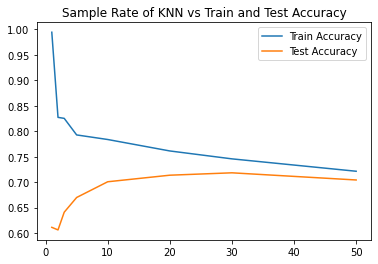
    


    
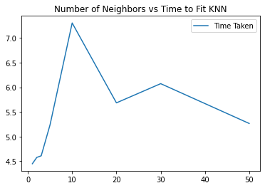
    


```python
#Repeat zoomed in
KNN = [10,15,20,25,30]
val_accuracy = []
train_accuracy = []
for neighbors in KNN:
    #instantiate model and record start time
    KNN_model = KNeighborsClassifier(n_neighbors=neighbors)
    #fit model 
    KNN_model.fit(X_train_KNN_norm,y_train_KNN)
    #get scores
    train_accuracy.append(KNN_model.score(X_train_KNN_norm,y_train_KNN))
    val_accuracy.append(KNN_model.score(X_val_KNN_norm,y_val_KNN))
#Plot Test and Validation Accuracy
sns.lineplot(x=KNN,y=train_accuracy)
sns.lineplot(x=KNN,y=val_accuracy)
plt.legend(['Train Accuracy','Test Accuracy'])
plt.title('Sample Rate of KNN vs Train and Test Accuracy')
plt.show()
```


    
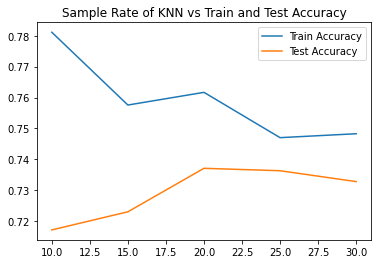
    


```python
#repeat for best fit above, n=20, then get accuracies for all three datasets.

#instantiate model and record start time
KNN_model = KNeighborsClassifier(n_neighbors=20)
#fit model 
KNN_model.fit(X_train_KNN_norm,y_train_KNN)
#get scores
print(f'Train Accuracy: {KNN_model.score(X_train_KNN_norm,y_train_KNN)}')
print(f'Validation Accuracy: {KNN_model.score(X_val_KNN_norm,y_val_KNN)}')
print(f'Test Accuracy: {KNN_model.score(X_test_KNN_norm,y_test)}')
```

    Train Accuracy: 0.7616722016018753
    Validation Accuracy: 0.737109375
    Test Accuracy: 0.7363487227560347


### Part E

It is important to perform vectorization on the train portion of the data set only.  If we use a portion of the validation set data to do our training, then we are leaking information from the validation set into the model.  If the model is informed of the contents of the validation set, and makes any sort of decision off that information, then the validation set cannot be considered a truly independent set of data.

## Question 3

### Part A

We start by fitting a simple decision tree with no defined max depth and min group size.


```python
#Instantiate and fit the decision tree with no fixed parameters
DT = DecisionTreeClassifier()
DT.fit(X_train_norm, y_train)
#get train and test accuracy.
print(f'Train Accuracy: {DT.score(X_train_norm,y_train)}')
print(f'Test Accuracy: {DT.score(X_test_norm,y_test)}')
```

    Train Accuracy: 0.9951554930457884
    Test Accuracy: 0.6594797281462386


The unoptimized decision tree is similar to the unoptimized KNN model.  Both lag behind the unoptimized logistic regression model.

### Part B


```python
#Set our possible N-neighbors and reset train and val accuracy logs
max_depth = [1,2,3,5,10,20,30,50]
val_accuracy = []
train_accuracy = []
#create validation set
X_train_DT, X_val_DT, y_train_DT, y_val_DT = train_test_split(X_train, y_train, test_size=.2)
#we do not need to scale here, so we will proceed directly to looping through the decision tree.
for depth in max_depth:
    #instantiate model and record start time
    DT = DecisionTreeClassifier(max_depth=depth)
    #fit model 
    DT.fit(X_train_DT,y_train_DT)
    #get scores
    train_accuracy.append(DT.score(X_train_DT,y_train_DT))
    val_accuracy.append(DT.score(X_val_DT,y_val_DT))
#Plot Test and Validation Accuracy
sns.lineplot(x=max_depth,y=train_accuracy)
sns.lineplot(x=max_depth,y=val_accuracy)
plt.legend(['Train Accuracy','Test Accuracy'])
plt.title('Max Depth of Decision Tree vs Train and Test Accuracy')
plt.show()


```


    
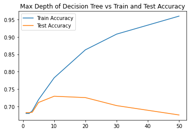
    


We will once again zoom in and try to get a more precise value for our max_depth parameter.


```python
#Set our possible N-neighbors and reset train and val accuracy logs
max_depth = [6,7,8,9,10,11,12,13]
val_accuracy = []
train_accuracy = []
time_taken = []
#create validation set
X_train_DT, X_val_DT, y_train_DT, y_val_DT = train_test_split(X_train, y_train, test_size=.2)
#we do not need to scale here, so we will proceed directly to looping through the decision tree.
for depth in max_depth:
    #instantiate model and record start time
    DT = DecisionTreeClassifier(max_depth=depth)
    #fit model 
    start_time = time.time()
    DT.fit(X_train_DT,y_train_DT)
    #get scores
    train_accuracy.append(DT.score(X_train_DT,y_train_DT))
    val_accuracy.append(DT.score(X_val_DT,y_val_DT))
    time_taken.append(time.time()-start_time)
#Plot Test and Validation Accuracy
sns.lineplot(x=max_depth,y=train_accuracy)
sns.lineplot(x=max_depth,y=val_accuracy)
plt.legend(['Train Accuracy','Test Accuracy'])
plt.title('Max Depth of Decision Tree vs Train and Test Accuracy')
plt.show()
sns.lineplot(x=max_depth,y=time_taken)
plt.legend(['Time Taken'])
plt.title('Tree Max Depth vs Time to Fit Decision Tree')
plt.show()
```


    
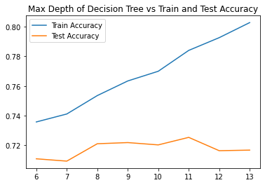
    


    
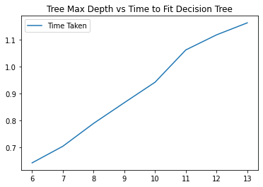
    


```python
val_accuracy
```


    [0.74296875,
     0.74453125,
     0.74296875,
     0.735546875,
     0.741796875,
     0.7375,
     0.732421875,
     0.734765625]


Our best validation accuracy was at max_depth = 7.  We will use this and check the test set.


```python
#instantiate model and record start time
DT = DecisionTreeClassifier(max_depth=7)
#fit model 
DT.fit(X_train_DT,y_train_DT)
#get scores
print(f'Train Accuracy: {DT.score(X_train_DT,y_train_DT)}')
print(f'Validation Accuracy: {DT.score(X_val_DT,y_val_DT)}')
print(f'Test Accuracy: {DT.score(X_test,y_test)}')
```

    Train Accuracy: 0.7498534870091815
    Validation Accuracy: 0.744140625
    Test Accuracy: 0.7243965315209749


Our test accuracy has improved significantly, and is 

### Part C

Decision trees tend to be faster than KNN models, especially for large datasets. We can see in the graphs above that the decision tree only takes 1ms for even a max depth of 13, while the KNN model takes about 6ms on average.  Decision trees also have the advantage of being very interpretable and easy to explain, even to non-data scientists.  However, decision trees have some disadvantages as well.  They can be very sensitive to initial conditions, and even small tweaks in the data may totally change the resulting tree.  They also can be prone to overfitting, as seen in the graphs above.

## Question 4

The validation set is used as a way for us to optimize our model without compromising the integrity of the test set.  It is possible to implicity train to the test set by continually adjusting hyperparameters to push up test accuracy.  Therefore, the validation set is used to optimize the model, whereas the test set is used to test the accuracy of the model once the optimization is complete.

## Question 5

### Part A

For this optimization problem we will use gridsearchCV, an sklearn feature with built in cross validation and the ability to easily map out a grid of hyperparameters to evaluate.


```python
parameters = {'max_depth':[5,10,20,30],'min_samples_split':[10,50,100,500]}
clf = GridSearchCV(DecisionTreeClassifier(), parameters,cv=None)
clf.fit(X=X_train, y=y_train)
#save the best model
DT_best = clf.best_estimator_
#print the best score and parameters
print (clf.best_score_, clf.best_params_) 
```

    0.7263629591637357 {'max_depth': 20, 'min_samples_split': 500}


### Part B


```python
#get predicted values using the best model from above
y_test_predicted = DT_best.predict(X_test)
confusion_matrix(y_test, y_test_predicted)/confusion_matrix(y_test, y_test_predicted).sum()
```


    array([[0.29646121, 0.12749004],
           [0.15772205, 0.41832669]])


We have roughly equal false positives and false negatives, but true positives are significantly less than true negatives.

## Part 6

As a new feature, we will sum up a total word count for each review.  This will hopefully increase the accuracy of the prediction.  The hypothesis is that people will tend to write longer reviews when they are upset.  From personal experience, most positive reviews tend to be short and say they were happy with everything.  Negative reviews tend to go into more detail about what goes wrong.


```python
X_train['Total'] = X_train.sum(axis=1)
X_test['Total'] = X_test.sum(axis=1)
```


```python
parameters = {'max_depth':[5,10,20,30],'min_samples_split':[10,50,100,500]}
clf = GridSearchCV(DecisionTreeClassifier(), parameters,cv=None)
clf.fit(X=X_train, y=y_train)
#save the best model
DT_best = clf.best_estimator_
#print the best score and parameters
print (clf.best_score_, clf.best_params_) 
```

    0.7258166336948026 {'max_depth': 10, 'min_samples_split': 500}


Unfortunately, our hypothesis did not have the desired effect.  Our accuracy for our best model is almost exactly the same as before.  This shows us that summing information is really just a duplicative effort from examining every word separately, in this case.


```python

```
